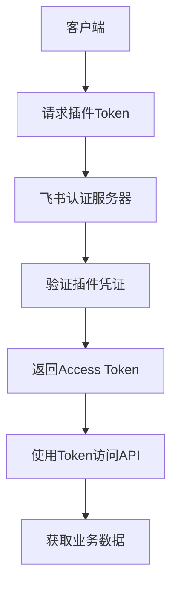
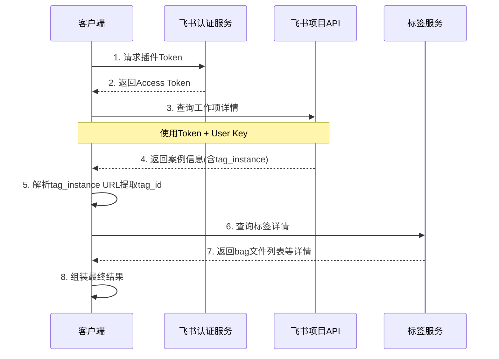

# 飞书 Open API 技术文档

## 概述

本文档详细介绍了飞书案例标签信息提取工具中使用的飞书 Open API 接口，包括认证机制、API端点、请求参数和响应格式。

## 认证体系

### 插件认证 (Plugin Authentication)

工具使用飞书项目的插件认证模式，这是一种专门为第三方插件设计的认证方式。

#### 认证流程



#### 1. 获取插件Token

**接口地址**
```
POST https://project.feishu.cn/open_api/authen/plugin_token
```

**请求头**
```http
Content-Type: application/json
```

**请求体**
```json
{
  "plugin_id": "MII_64EDCCED5EC38003",
  "plugin_secret": "F0B574D7270754A7A4BF4EB60FEBD5C4",
  "type": 0
}
```

**参数说明**

| 参数名 | 类型 | 必填 | 说明 |
|--------|------|------|------|
| plugin_id | string | 是 | 插件唯一标识符 |
| plugin_secret | string | 是 | 插件密钥 |
| type | integer | 是 | 认证类型，固定为0 |

**响应格式**
```json
{
  "err_code": 0,
  "err_msg": "success",
  "data": {
    "token": "实际的访问令牌字符串",
    "expire": 7200
  }
}
```

**响应字段说明**

| 字段名 | 类型 | 说明 |
|--------|------|------|
| err_code | integer | 错误码，0表示成功 |
| err_msg | string | 错误消息 |
| data.token | string | 访问令牌 |
| data.expire | integer | 令牌过期时间（秒） |

## 业务API接口

### 1. 工作项查询接口

这是核心的业务接口，用于查询飞书项目中的工作项（案例）详细信息。

**接口地址**
```
POST https://project.feishu.cn/open_api/{project_key}/work_item/{work_item_type_key}/query
```

**URL参数**

| 参数名 | 说明 | 示例值 |
|--------|------|--------|
| project_key | 项目标识符 | `iffcom` |
| work_item_type_key | 工作项类型标识符 | `681329d725ac1e8647ae80bd` |

**请求头**
```http
Content-Type: application/json
X-USER-KEY: 7135084032966115356
X-PLUGIN-TOKEN: {从认证接口获取的token}
```

**请求体**
```json
{
  "work_item_ids": [6212443041],
  "fields": [],
  "expand": {
    "need_workflow": true,
    "relation_fields_detail": true,
    "need_multi_text": true,
    "need_user_detail": true,
    "need_sub_task_parent": true
  }
}
```

**参数详细说明**

| 参数名 | 类型 | 必填 | 说明 |
|--------|------|------|------|
| work_item_ids | array | 是 | 要查询的工作项ID列表 |
| fields | array | 否 | 指定返回的字段，空数组表示返回所有字段 |
| expand | object | 否 | 扩展选项 |
| expand.need_workflow | boolean | 否 | 是否需要工作流信息 |
| expand.relation_fields_detail | boolean | 否 | 是否需要关联字段详情 |
| expand.need_multi_text | boolean | 否 | 是否需要多行文本字段 |
| expand.need_user_detail | boolean | 否 | 是否需要用户详细信息 |
| expand.need_sub_task_parent | boolean | 否 | 是否需要子任务父级信息 |

**响应格式**
```json
{
  "err_code": 0,
  "err_msg": "success",
  "data": [
    {
      "id": 6212443041,
      "name": "案例名称",
      "fields": [
        {
          "field_alias": "tag_instance",
          "field_name": "标签实例",
          "field_value": "https://drplatform.deeproute.cn/#/diagnosis-management/diagnosis?tripName=YR-C01-72_20250722_113032&online=online&id=36008727&path=/issue/diagnosis",
          "field_type": "text"
        }
      ]
    }
  ]
}
```

**关键字段说明**

| 字段路径 | 类型 | 说明 |
|----------|------|------|
| data[].id | integer | 工作项ID |
| data[].name | string | 工作项名称 |
| data[].fields | array | 字段列表 |
| data[].fields[].field_alias | string | 字段别名 |
| data[].fields[].field_value | string | 字段值 |

### 2. 工作项类型常量

在飞书项目系统中，不同类型的工作项有不同的类型标识符：

| 工作项类型 | Type Key | 说明 |
|------------|----------|------|
| 缺陷 | `681329d725ac1e8647ae80bd` | 用于查询缺陷类型的工作项 |
| 需求 | `其他值` | 其他工作项类型需要单独查询 |

## 外部API接口

### 标签详情查询接口

虽然不是飞书的API，但这个接口是业务流程中的重要环节。

**接口地址**
```
GET https://drplatform-backend.deeproute.cn/scene/tag/instance/{tag_id}
```

**URL参数**

| 参数名 | 说明 | 示例值 |
|--------|------|--------|
| tag_id | 标签ID | `36008727` |

**响应格式**
```json
{
  "body": {
    "id": 36008727,
    "systemTime": 1753236315993777.0,
    "bagsName": [
      "YR-C01-72_20250723_020440.Light_Topic_Group.bag",
      "YR-C01-72_20250723_020440.Medium_Topic_Group.bag"
    ],
    "feishuProjectId": "https://project.feishu.cn/iffcom/case/detail/6212443041"
  }
}
```

## API使用流程

### 完整的数据获取流程



### 错误处理

#### 认证错误

| 错误码 | 错误信息 | 解决方案 |
|--------|----------|----------|
| 401 | Unauthorized | 检查plugin_id和plugin_secret |
| 403 | Forbidden | 检查插件权限配置 |

#### 业务错误

| 错误码 | 错误信息 | 解决方案 |
|--------|----------|----------|
| 404 | Work item not found | 检查工作项ID是否存在 |
| 400 | Invalid work item type | 检查work_item_type_key是否正确 |

## 代码实现示例

### Python实现

```python
import requests

class FeishuAPIClient:
    def __init__(self, plugin_id, plugin_secret, user_key):
        self.plugin_id = plugin_id
        self.plugin_secret = plugin_secret
        self.user_key = user_key
        self.endpoint = "https://project.feishu.cn/open_api"
        self.token = None
    
    def get_token(self):
        """获取插件Token"""
        url = f"{self.endpoint}/authen/plugin_token"
        data = {
            "plugin_id": self.plugin_id,
            "plugin_secret": self.plugin_secret,
            "type": 0,
        }
        
        response = requests.post(url, json=data)
        response.raise_for_status()
        
        result = response.json()
        if result.get("err_code") != 0:
            raise Exception(f"获取Token失败: {result.get('err_msg')}")
        
        self.token = result["data"]["token"]
        return self.token
    
    def query_work_item(self, project_key, work_item_type_key, work_item_ids):
        """查询工作项"""
        if not self.token:
            self.get_token()
        
        url = f"{self.endpoint}/{project_key}/work_item/{work_item_type_key}/query"
        headers = {
            "Content-Type": "application/json",
            "X-USER-KEY": self.user_key,
            "X-PLUGIN-TOKEN": self.token,
        }
        
        data = {
            "work_item_ids": work_item_ids,
            "fields": [],
            "expand": {
                "need_workflow": True,
                "relation_fields_detail": True,
                "need_multi_text": True,
                "need_user_detail": True,
                "need_sub_task_parent": True
            }
        }
        
        response = requests.post(url, headers=headers, json=data)
        response.raise_for_status()
        
        result = response.json()
        if result.get("err_code") != 0:
            raise Exception(f"查询工作项失败: {result.get('err_msg')}")
        
        return result["data"]
```

## 最佳实践

### 1. Token管理
- Token有效期为2小时，建议实现自动刷新机制
- 建议在Token过期前主动刷新，而不是等待401错误

### 2. 错误重试
- 网络错误建议实现指数退避重试
- 业务错误（如404）不建议重试

### 3. 批量处理
- 工作项查询接口支持批量查询，建议一次查询多个工作项
- 但要注意批量大小，建议不超过100个

### 4. 安全考虑
- plugin_secret应当安全存储，不要硬编码在客户端代码中
- 建议使用环境变量或配置文件管理敏感信息

## API限制

### 请求频率限制
- 具体限制未在文档中明确，建议实际使用中控制请求频率
- 推荐每秒不超过10个请求

### 数据量限制
- 单次查询工作项数量建议不超过100个
- 字段数据长度有限制，超长文本可能被截断

## 版本信息

- **API版本**: 未明确标注版本号
- **文档版本**: v1.0
- **最后更新**: 2025年7月23日

## 相关资源

- [飞书开放平台官方文档](https://open.feishu.cn/)
- [飞书项目管理文档](https://project.feishu.cn/help)

## 联系方式

如有API相关问题，请联系飞书项目技术支持团队。
