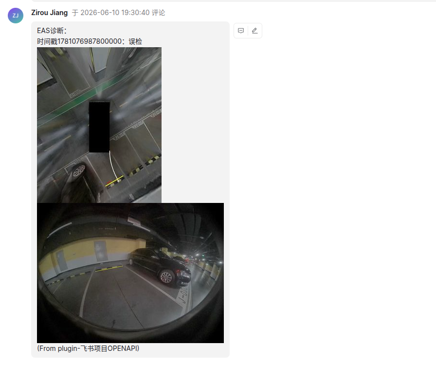
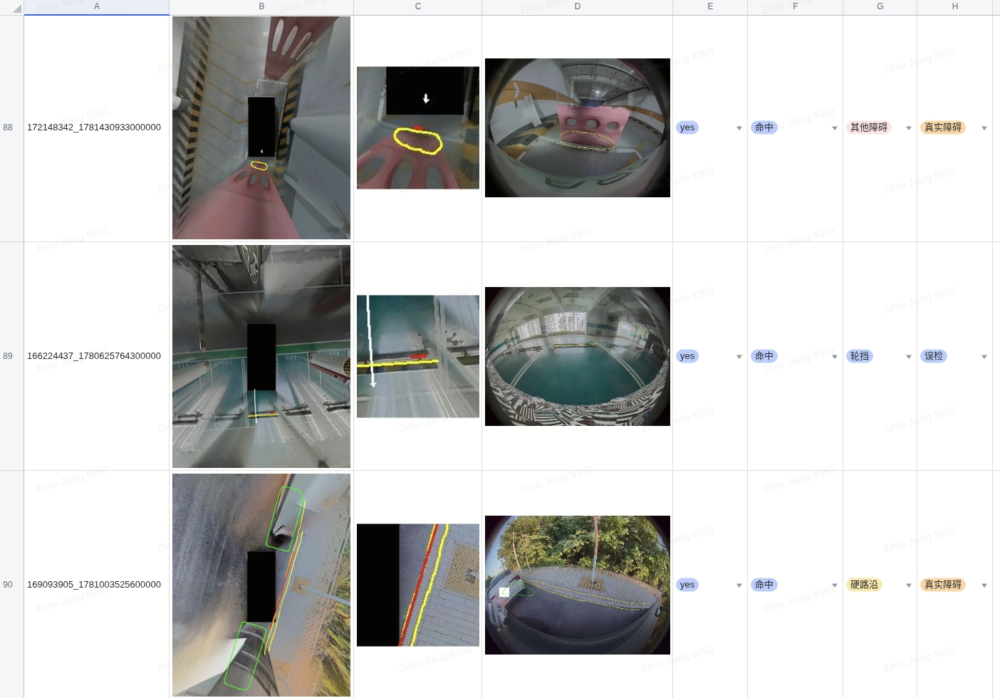
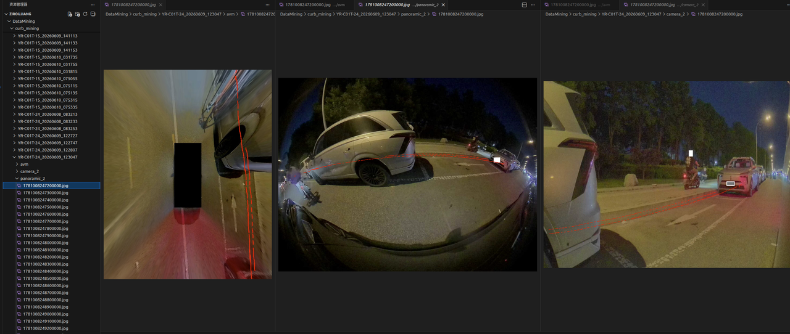

# 泊车超声误检自动诊断系统

基于视觉语言模型（可选供应商api或微调模型），对泊车环视场景中的超声障碍物检测结果进行自动化误检诊断。系统从飞书项目获取待诊断 case，自动解包 bag 数据、生成 AVM 全景图、绘制标注图像、调用模型诊断，最终将结果回写飞书评论及收集，可用于下一轮模型迭代。


> 飞书评论效果


> 推理结果收集,可用于下一轮模型迭代


> 数据拼接与标注效果

## 快速开始

```bash
# 1. 配置环境变量
cp .env.example .env
# 编辑 .env，填入 DR 平台、VLM API、飞书等凭证

# 2. 运行主流程（默认：微调模型诊断 + 上传飞书）
python pipeline.py

# 2.1 可选：gemini-3.1-pro-preview 诊断（不上传飞书表格）
python pipeline.py --openai-diagnose
```

## Pipeline 主流程

`pipeline.py` 是项目核心，串联 7 个步骤完成端到端诊断：

```
飞书项目视图
    │
    ▼
┌─ Step 1 ─┐  获取 tag_id ↔ feishu_id 映射
│           │  → get_data/id_mapping.json
└───────────┘
    │
    ▼
┌─ Step 3 ─┐  解包 bag → samples（鱼眼帧）+ read_data（超声/定位/规划）
│           │  每 tag 独立 BagReader，多 tag 可并行
└───────────┘
    │
    ▼
┌─ Step 4 ─┐  鱼眼拼接 AVM 全景图
│           │  调用 offline_avm_generate_release 的 C++ 工具
└───────────┘
    │
    ▼
┌─ Step 5 ─┐  绘制 AVM 标注图像
│           │  在 BEV 上叠加超声高亮、相机障碍投影、车位等标注
└───────────┘
    │
    ▼
┌─ Step 6 ─┐  模型诊断（二选一）
│  默认     │  【默认】EAS 微调模型三分类 → 映射「是否误检」→ diagnosis_logs/MMDD/ + pipeline_data/
│  --openai-│  【可选】VLM 大模型（Gemini / OpenAI 兼容）多任务诊断 → diagnosis_logs/MMDD/ + result_avm/
│  diagnose │
└───────────┘
    │
    ▼
┌─ Step 7 ─┐  诊断结果 + 图片上传飞书电子表格（默认开启，追加去重）
│           │  --openai-diagnose 或 --skip-steps 7 时跳过
└───────────┘
```

> Step 2 已移除（原「获取 bag 列表」功能由 Step 3 内部完成）。

### 常用参数

| 参数 | 说明 |
|------|------|
| `-p / --project-key` | 飞书项目 Key（默认 `iffcom`） |
| `-v / --view-id` | 飞书视图 ID（默认 当天缺陷数据 `U9zPLpFvR`） |
| `--no-comment` | 不发送飞书评论 |
| `--skip-steps 1 3` | 跳过指定步骤（可用编号：1/3/4/5/6/7） |
| `--openai-diagnose` | Step6 改用 VLM gemini-3.1-pro-preview 诊断（自动跳过 Step 7） |
| `--model gemini-3-pro-preview` | `--openai-diagnose` 时指定 VLM 模型 |
| `--feishu-sheet-url` | Step 7 上传目标飞书表格（默认已配置，支持 wiki / sheets 链接） |
| `--no-yuyan` | 关闭鱼眼解包与鱼眼辅助 |
| `--chaosheng-pixel-radius 40` | Step 5 超声-相机关联半径（默认 30） |
| `--unpack-workers 1` | Step 3 并行解包数（默认 min(CPU, 4)） |

## 数据目录

所有中间产物默认位于 `AVP_DATA_BASE`（`/mnt/public-data/user/ziroujiang/avp`）：

```
avp/                             # AVP_DATA_BASE
├── samples/                     # Step3: 解包的鱼眼原始帧
├── read_data/                   # Step3: 超声/定位/规划结构化数据
├── generate/                    # Step4: AVM 全景图
├── draw_image/                  # Step5: 标注后的 AVM 图像
├── result_avm/                  # Step6 --openai-diagnose: VLM 大模型诊断结果
└── diagnosis_logs/              # Step6 默认分支 + 运行日志
    └── MMDD/                    #   按日期：pipeline 日志 + EAS 的 jsonl/csv

pipeline_data/                   # AVP_PIPELINE_DATA_DIR（独立于 avp/）
├── images/                      # Step6 默认分支：从 draw_image 收集的 AVM 图
├── crop/                        #   超声质心局部裁剪图
└── yuyan/                       #   鱼眼图
```

## 项目结构

```
avp_promptkit/
├── pipeline.py                  # 主流程入口
├── config.py                    # 统一配置（凭证、路径、Topic）
├── .env.example                 # 环境变量模板
│
├── get_data/                    # 数据获取层
│   ├── get_id_mapping.py        #   飞书视图 → tag_id/feishu_id 映射
│   ├── bag_reader.py            #   远端 bag 读取与解包
│   ├── unpack_bag_for_avm.py    #   解包 bag 到 samples/
│   ├── save_bag_data.py         #   提取超声/定位/规划 → read_data/
│   ├── get_meta_data.py         #   DR 平台 tag 元数据查询
│   └── ...                      #   车辆配置、相机参数、地面参数等
│
├── vlm/                         # VLM 诊断引擎
│   ├── avp_vlm_pipeline_avm.py  #   Step5 绘图 + Step6 VLM 诊断主逻辑
│   ├── VLM_API.py               #   VLM API 调用封装（OpenAI / Vertex）
│   ├── panoramic_projector.py   #   鱼眼→BEV 投影
│   └── point2box_mindistance_avm.py  # 超声-相机障碍最近距离匹配
│
├── prompts_engine/              # Prompt 构建引擎（LangChain + Jinja2）
│   ├── configs/                 #   Agent 配置
│   ├── templates/               #   Prompt 模板
│   ├── context/                 #   Context 构建器
│   └── engine/                  #   Agent 基类、工厂、任务管理
│
├── comment/                     # 飞书项目评论
│   ├── add_comment.py           #   发送诊断结果评论
│   ├── get_comment_id.py        #   查询评论 ID
│   └── remove_comment.py        #   删除评论
│
├── offline_avm_generate_release/  # AVM 拼接工具（C++ 二进制 + 启动脚本）
│
├── tool/                        # 辅助工具脚本
│   ├── eas_eval.py              #   EAS 微调模型评测
│   ├── build_labels.py          #   三分类 → 是否误检 映射规则
│   ├── collect_raw_data.py      #   draw_image → 平铺结构转换
│   ├── upload_predictions_to_feishu.py  # 预测结果上传飞书表格
│   ├── sync_raw_images_to_feishu_sheet.py  # 原始图片同步到飞书表格
│   ├── export_feishu_labels_csv.py  # 从飞书表格导出标签 CSV
│   ├── diagnose_val_dataset.py  #   验证集离线诊断
│   ├── diagnose_liuyi_benchmark.py  # liuyi benchmark 批量诊断
│   ├── crop_read_data_chaosheng.py  # 超声质心局部裁剪
│   └── ...                      #   其他数据处理与可视化工具
│
└── proj/                        # 模型训练相关
    ├── run.py                   #   打包代码 + scp 到 PAI 集群
    └── train.sh                 #   ms-swift LoRA SFT
```

## 环境变量

参照 `.env.example` 配置，主要分为四组：

| 分组 | 变量 | 说明 |
|------|------|------|
| DR 平台 | `DR_USERNAME` / `DR_PASSWORD` | 远端 bag 数据访问凭证 |
| EAS 微调模型 | `EAS_BASE_URL` / `EAS_TOKEN` / `EAS_MODEL` | PAI-EAS 部署地址、Token、模型名 |
| VLM API | `VLM_API_KEY` / `VLM_BASE_URL` / `VLM_MODEL` | `--openai-diagnose` 时的gemini-3.1-pro-preview 配置 |
| 飞书 | `FEISHU_PLUGIN_ID` / `FEISHU_PLUGIN_SECRET` / `FEISHU_USER_KEY` | 飞书项目 API 凭证 |
| 数据路径 | `AVP_DATA_BASE` | 中间产物根目录（默认 `/mnt/public-data/user/ziroujiang/avp`） |

## 模型相关

### 数据集

训练数据位于 `/mnt/public-data/user/ziroujiang/all_data_v3/train_dataset_v5.jsonl`，配套验证集为同目录下的 `val_dataset_v5.jsonl`（2,201 条 / 757 case，约 10%）。

| 维度 | 数值 |
|------|------|
| 训练样本数 | 19,819 |
| 训练 case 数 | 6,809（其中完整三任务 case 6,505） |
| 覆盖 tag 数 | 3,495 |
| 输入模态 | 3 图/样本：AVM 鸟瞰 + 超声质心 crop + 单路鱼眼 |

每条样本对应一个超声高亮时刻，模型需完成三个子任务（各 1 条 jsonl 记录）：

| 子任务 | 样本数 | 标签分布 |
|--------|--------|----------|
| 实体存在性 | 6,809 | yes 95.5% / no 4.5% |
| 几何一致性 | 6,505 | aligned 81.3% / misaligned 18.7% |
| 障碍物类型 | 6,505 | 其他障碍 42.4%、轮挡 15.9%、泊车路沿 11.3%、减速带 11.0%、硬路沿 10.9%、地面异常 8.6% |

完整三任务 case 经 `build_labels.py` 规则映射为「是否误检」后，训练集分布为：**误检 57.7%** / **真实障碍 42.3%**。

基座模型 **Qwen3.5-27B**，LoRA SFT（ms-swift），详见 `proj/train.sh`。

### 最终表现

在 `val_dataset_v5`（757 case）上对比Qwen3.5-27B（EAS 部署）与gemini-3.1-pro-preview（VLM 零样本）的误检诊断效果：

| 指标 | Qwen3.5-27B | gemini-3.1-pro-preview |
|------|----------|------------|
| 准确率 | **95.50%** | 78.88% |
| 误检 Precision | 95.17% | 84.83% |
| 误检 Recall | 97.18% | 77.46% |
| 误检 F1 | 96.17% | 80.98% |
| Macro-F1 | 95.37% | 78.62% |

Qwen3.5-27B在各指标上均显著优于通用gemini-3.1-pro-preview，误检 Recall 提升约 20 个百分点，整体 Macro-F1 领先约 17 个百分点。